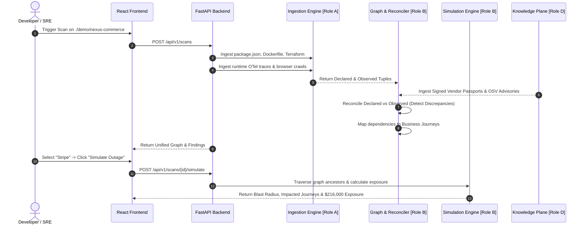

# HDX End-to-End Data Flow

The lifecycle of dependency discovery in HDX follows six discrete stages:

```mermaid
sequenceDiagram
    autonumber
    actor Dev as Developer / SRE
    participant UI as React Frontend
    participant API as FastAPI Backend
    participant Ingest as Ingestion Engine [Role A]
    participant Graph as Graph & Reconciler [Role B]
    participant Sim as Simulation Engine [Role B]
    participant KP as Knowledge Plane [Role D]

    Dev->>UI: Trigger Scan on ./demo/nexus-commerce
    UI->>API: POST /api/v1/scans
    API->>Ingest: Ingest package.json, Dockerfile, Terraform
    API->>Ingest: Ingest runtime OTel traces & browser crawls
    Ingest-->>Graph: Return Declared & Observed Tuples
    KP-->>Graph: Ingest Signed Vendor Passports & OSV Advisories
    Graph->>Graph: Reconcile Declared vs Observed (Detect Discrepancies)
    Graph->>Graph: Map dependencies to Business Journeys
    API-->>UI: Return Unified Graph & Findings
    
    Dev->>UI: Select "Stripe" -> Click "Simulate Outage"
    UI->>API: POST /api/v1/scans/{id}/simulate
    API->>Sim: Traverse graph ancestors & calculate exposure
    Sim-->>UI: Return Blast Radius, Impacted Journeys & $216,000 Exposure
```

